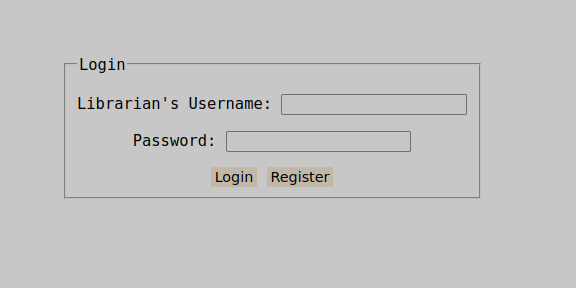
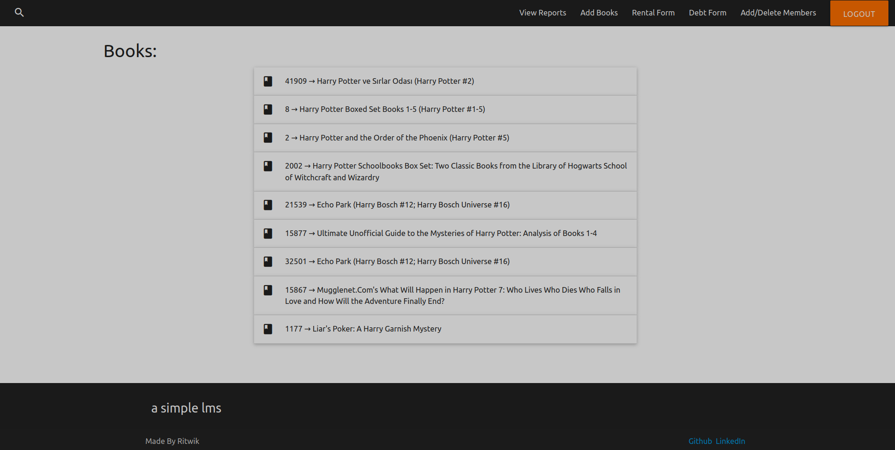
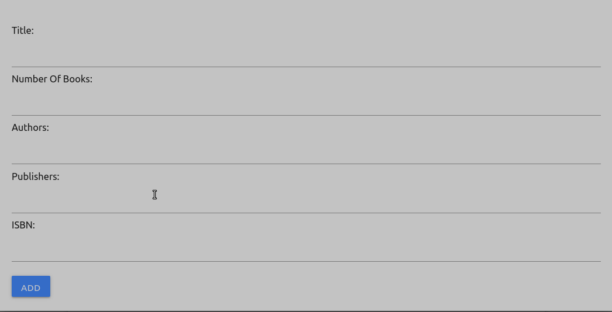
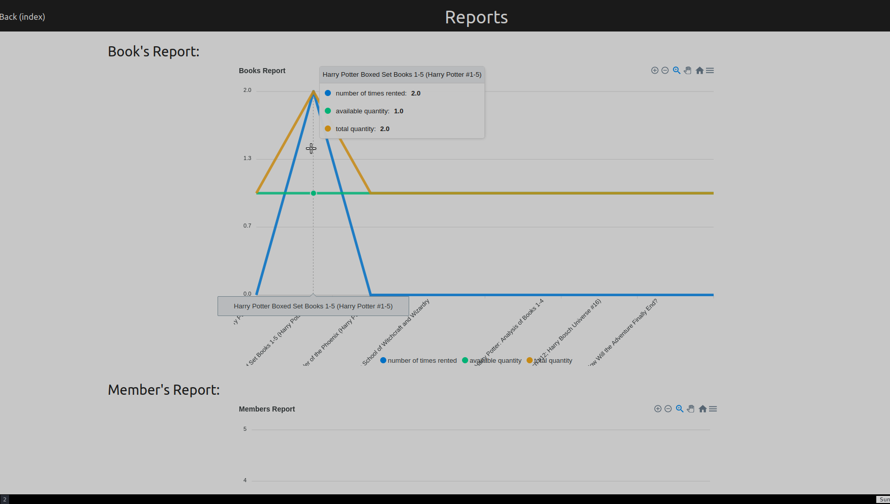

## a simple lms

### Setup
- prereqs: 
    - [python 3.7+](https://www.python.org/downloads/)
    - [sqlite3](https://www.sqlite.org/index.html)

- clone the repo, install the dependencies -- `pip3 install -r requirements.txt`

- run the app -- `python3 app.py`

- go to [localhost:5000](http://localhost:5000) to view the app

#

### Explanation/Design

> NOTE: The design process can be viewed at [design.txt](design.txt) as well.

#### Database
- it has 4 tables - librarians, members, books & sessions (You can checkout the schema in [models.py](models.py))

- the first 3 tables store what they're declaring i.e Librarians, Members & Books data.

- books table is populated using the frappe's api.

- the sessions table is a bit special as it stores the sessions of librarians.
    - as cookies are of the form `key=value` this table is also designed in that way where a librarian can have upto 4 sessions active parallely and the first added sessions are automarically removed from the db when a 5th session is made by the same librarian.
        - > Note: this is a simple session management concept that i wanted to try so it's nothing complex. it can be considered as a simple demo/poc.

#### Views/Routes
- these can be found in [routes.py](routes.py) and their bindings/mappings can be found in [app.py](app.py) where flask's [Centalized Url Mapping Pattern](https://flask.palletsprojects.com/en/2.0.x/patterns/lazyloading/#converting-to-centralized-url-map) has been used.

- there are mainly 4 routes -- /, /index, /reports & /logout

- / or the login route is used to login/register a librarian which inturn creates a session in the sessions table in db (when successfully logged in) and also stores a cookie in the browser for the same. this cookie is then validated at every route/view the librarian visits.

- after logging in, comes the index page/route which has all the workings of the web-app.

    - Here we can add books, rent/take return for the book, add/delete members, take up the rent/debt from the members (based on the number of days rented), view reports and even search books (on the basis of bookid, title and author)
    - [Materialize css](https://materializecss.com/) has been used for making this page (as well as the reports one)
    - If the librarian clicks on `logout` button in the index page, the session will be deleted in the sessions table in the db (but the cookie will remain the browser and will get updated/overwritten when the librarian logs in again as the key in the cookie is the librarian's username)
    - All the searchable fields in the frappe's api have been utilized i.e librarian can add books on the basis of title, author, isbn, publisher as well as can specify the number of books to add.
    

- clicking on `View Reports` in the index page will send us to reports route/page where we can view the reports of books quantities and popularity and also which member has paid how much.

    - [Apexcharts](https://apexcharts.com/) has been used for making the charts and the linked js code can be found in [reports.html](templates/reports.html) in the `<script>` tag at the bottom.

#

### TODO
- guest/member sessions -- This will lead to a lot of design change from the current scenario as currently only librarian was taken as the user. 
- make code better - there are a lot of areas where the code can be made better so that is also something to be done
